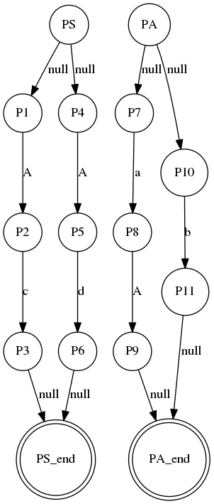
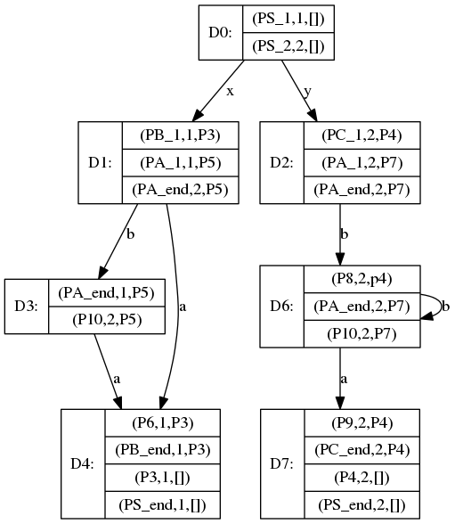

# Lab1-2

<center>PB16111485 张劲暾</center>

***

## 问题1. 分析和总结 ANTLR 对左递归文法的处理方法

* ANTLR 容许哪些类型的左递归？

答：ANTLR v4可以处理直接左递归，不能处理间接左递归

* ANTLR 对所支持的左递归如何处理？例如，对下面两种情况分别会怎样解析？

  > Exp : Exp '*' Exp | Exp '+' Exp | IntConst;
  > Exp : Exp '+' Exp | Exp '\*' Exp | IntConst;

答：按照优先级消除左递归，例如：

> 1. Exp[int _p]  //\_p is expected minimum precedence level
>
>    :	( IntConst
>
>     	)
>
>    ​	( {2 >= $_p}? '*' Exp[3]  // * has precedence 2
>
>    ​	|{1 >= $_p}? '+' Exp[2]  // + has precedence 1
>
>    ​	)
>
>    ;
>
> 2. Exp[int _p]  //\_p is expected minimum precedence level
>
>    :	( IntConst
>
>     	)
>
>    ​	( {2 >= $_p}? '+' Exp[3]  // + has precedence 2
>
>    ​	|{1 >= $_p}? '*' Exp[2]  // * has precedence 1
>
>    ​	)
>
>    ;

* ANTLR 能为上面哪一种情况构造出符号'*'的优先级比'+'高的表达式解析器？这是基于ANTLR 采用的什么样的二义性消除规则？

答：第一种，这是因为ANTLR 采用优先考虑排位靠前的二义性消除规则

* 如果将下面的第1行改写成第2行，那么生成的解析器源码有什么样的变化？请理解和说明 '# Mult' 的作用和意义。

> Exp : Exp '\*' Exp | Exp '+' Exp | IntConst;
> Exp : Exp '\*' Exp # Mult | Exp '+' Exp # Add | IntConst # Int ;

答：

第1行：
```java
public interface ExpListener extends ParseTreeListener{
    void enterExp(ExpParser.ExpContest ctx);
	void exitExp(ExpParser.ExpContest ctx);
    ...
}
public void exitExp(ExpParser.ExpContext ctx) { 
    if ( ctx.getChildCount()==3 ) { // operations have 3 children 
        int left = values.get(ctx.e(0)); 
        int right = values.get(ctx.e(1)); 
        if ( ctx.op.getType()==ExpParser.MULT ) { 
            values.put(ctx, left * right); 
        } 
        else { 
            values.put(ctx, left + right); 
        } 
    } 
    else { 
        values.put(ctx, values.get(ctx.getChild(0))); // an INT 
    }
}
```
第2行：

```java
public interface ExpListener extends ParseTreeListener{
    void enterMult(ExpParser.MultContest ctx);
	void exitMult(ExpParser.MultContest ctx);
    void enterAdd(ExpParser.AddContest ctx);
	void exitAdd(ExpParser.AddContest ctx);
    void enterInt(ExpParser.IntContest ctx);
	void exitInt(ExpParser.IntContest ctx);
    ...
}
```


标记产生式（Labeling Rule Alternatives）：
作用：缩小语法树构建的粒度，得到更精确的Listener和上下文对象

意义：

1. 得到更精确的Listener和上下文对象，使分析结构更加清晰，而不是笼统地构建在一棵语法分析树中

2. 方便重用和改写，不用修改整个语法分析树

* 给出ANTLR 不支持的左递归文法的例子并尝试分析原因。

答：例如：

>  A -> B
>  B -> cB
>
>  或者：
>
>  A -> Ac

隐含的(或者一些直接的)左递归，将会导致无限递归至栈溢出

## 问题2. 阅读 [LL(*) 分析方法](http://www.antlr.org/papers/LL-star-PLDI11.pdf) [[PLDI 2011](http://pldi11.cs.utah.edu/)]，并回答以下问题

* 简述LL(*)分析方法的核心逻辑，它与传统的LL分析区别在哪里？

答：LL(*)核心逻辑：根据输入串和语法规则为每一个语法分析决定构建前窥有限自动机(Lookahead DFA)；

与传统LL分析的区别：

1. LL(*)是基于断言LL正则语法的，是利用整个剩余的输入串匹配产生式的，而不是根据向前看的几个终结符。
2. LL构建的DFA不带环，LL(*)构建的DFA带环

* 证明下面的文法为LL-regular文法，并按照文章的LL(*) parser构造算法绘制该文法的ATN和Lookahead DFA。在算法执行过程中会出现哪些问题？解释问题产生的原因。假设ATNLR允许的最大递归深度m=1。
> S → Ac | Ad
> A → aA | b

答：

正则划分：

$$
R_1 = a^* b^+ c
$$
$$
R_2 = a^* b^+ d
$$
对于推导：
$$
S \Rightarrow^*_l a^*A\alpha \Rightarrow_l a^*\delta\alpha \Rightarrow^*_l a^*x
$$
$$
S \Rightarrow^*_l a^*A\alpha \Rightarrow_l a^*\gamma\alpha \Rightarrow^*_l a^*y
$$
若有 
$$
x\equiv y(mod  \pi)
$$
因为推导式中只可能最多有一个A，则有：
$$
\alpha \in T^*
$$
$$
\delta = \gamma
$$
所以该文法为LL-regular文法




出现的问题：分析A时会出现递归溢出

产生的原因：A → aA 会导致栈中有多于一个A

***

## 问题3. 阅读[Adaptive LL(*)分析方法](https://dl.acm.org/citation.cfm?id=2660202)[[OOPSLA 2014](https://2014.splashcon.org/)]，并回答以下问题

* 简述ALL(\*)分析方法的核心逻辑，试比较它与LL(\*)分析方法的区别。

答：

1. 核心逻辑：
  1. 在语法分析器构建时再进行语法分析，而不是静态分析
  2. 在每一个决策点为每条产生式产生一个子语法分析器，并行地进行接下来的语法分析直到与剩余输入序列不符或者匹配产生式最短可区分前缀
  3. 不用一次性从静态规则生成DFA，而是可以储存分析结果，根据陆续地输入逐步构建DFA
  4. 利用调用栈辅助分析处理非左递归文法
2. 与LL(\*)分析方法的区别：
    1. 不是静态分析，所以可以处理一些如套接字之类的流序列
    2. 不是一次构建，灵活性高调整代价小
    3. 更能处理上下文无关文法，避免了一些不必要的失败
    4. 使用自适应预测函数(adaptivePredict)预测产生式，而不是通过向前看k个输入符号
    5. 仅对看到的序列构造DFA，而不是对所有可能的序列构造DFA
    6. 利用调用栈信息辅助分析

* 给定如下文法，描述输入"xba"的ALL(*)分析过程并给出最终构造的lookahead DFA。

> S → xB | yC
> B → Aa
> C → Aba
> A → b | ε

答：

首先构建扩展转移网络如图所示：

第一步：产生D0
第二步：按照S → xB和扩展转移网络依次构建D1，D3，D4
第三步：按照S → yC和扩展转移网络依次构建D2，D5，D6，这个过程需要调用非空closure函数
